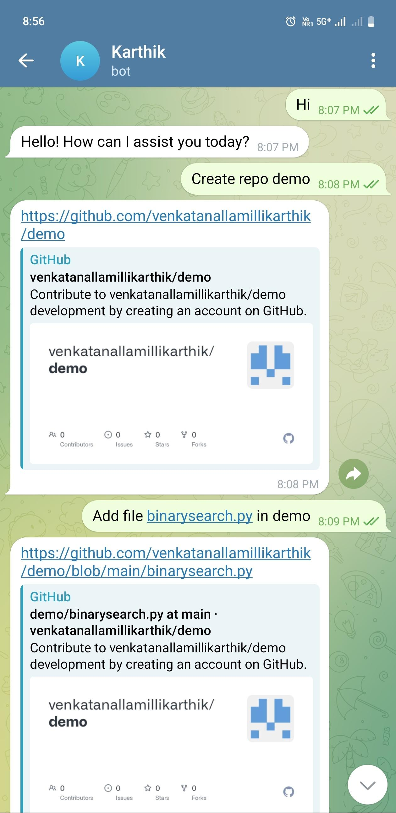
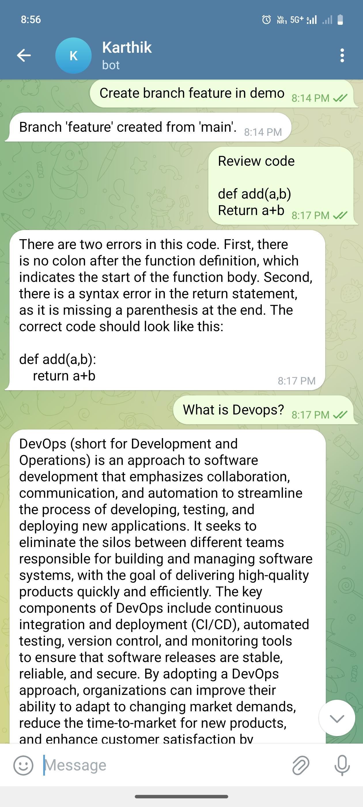
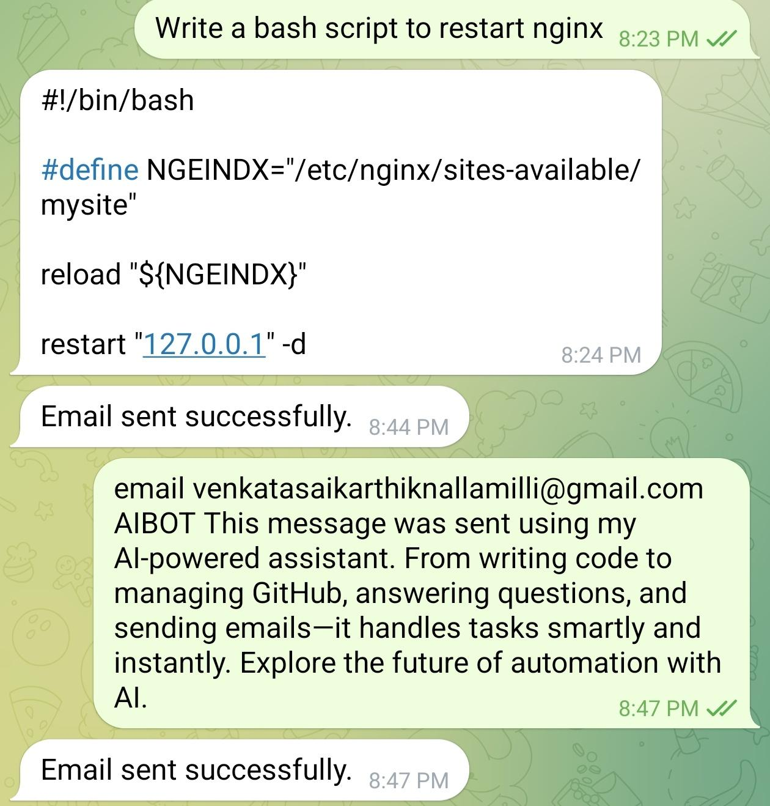
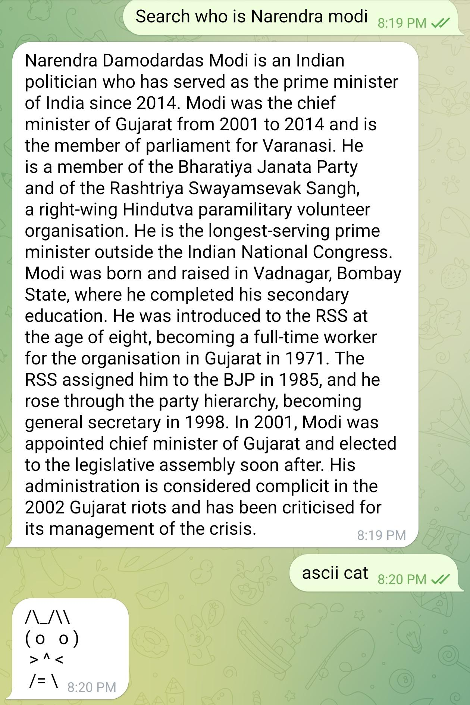
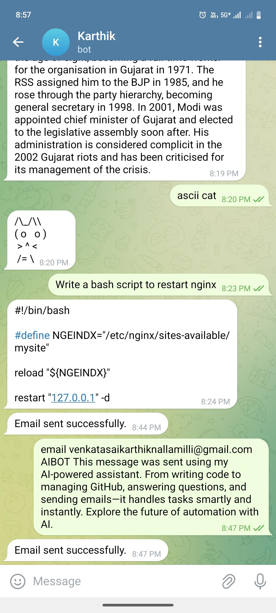
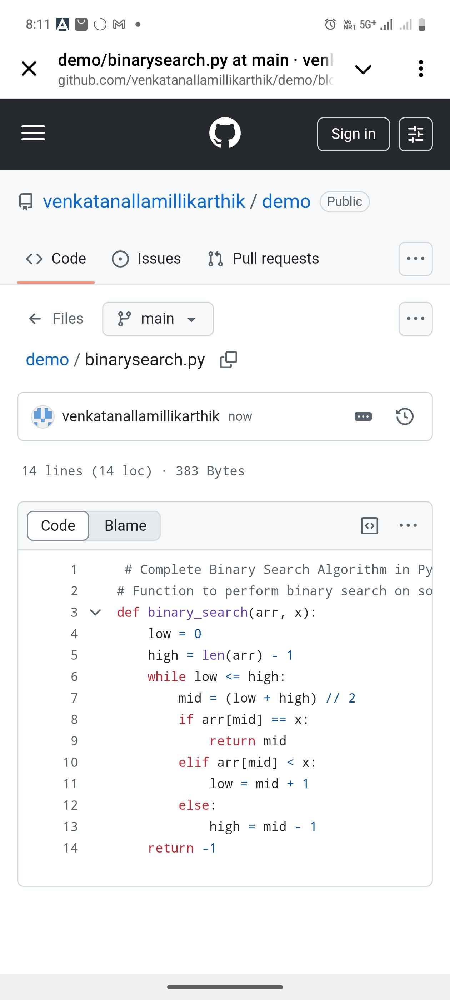

# 🚀 AI-Powered Telegram Developer Assistant

Your personalized **AI Developer Assistant** directly inside Telegram!
This bot helps you manage GitHub repositories, generate Python code, handle files, create pull requests, send emails, search the web, generate ASCII art, and more — using simple Telegram messages.

All powered by **local AI models via Ollama** + Flask + GitHub API + SMTP.

---

## 📌 Why This Project?

This project turns your Telegram chat into a powerful AI-driven coding assistant, eliminating UI overhead and automating daily developer tasks.

**Runs 100% locally on your own VM (EC2). No SaaS or subscription fees.**

---

## 📦 Key Features

* ✅ GitHub repository & branch management
* ✅ File creation, deletion, commits via chat
* ✅ AI-based Python code generation via Ollama (Mistral, Phi)
* ✅ Create pull requests & auto-review code via AI
* ✅ ASCII art generation
* ✅ Email sending via SMTP
* ✅ Web search fallback (DuckDuckGo + Wikipedia)
* ✅ Simple & secure Telegram chat interface

---

## 💻 Infrastructure Requirements

* **Cloud VM:** AWS EC2 (recommended: `t3.medium` or `t2.large`)
* **Swap Memory:** At least 4GB swap memory for running local LLMs smoothly
* **OS:** Ubuntu 20.04 / 22.04 (preferred)

---

## ⚙️ Setup Guide

### 1️⃣ Install Required Packages

```bash
sudo apt update
sudo apt install python3-venv -y
```

### 2️⃣ Clone the Repository

```bash
git clone https://github.com/venkatanallamillikarthik/chatops-telegram-bot.git
cd chatops-telegram-bot
```

### 3️⃣ Create & Activate Python Virtual Environment

```bash
python3 -m venv venv
source venv/bin/activate
```

### 4️⃣ Install Python Dependencies

```bash
pip install flask requests python-telegram-bot python-dotenv wikipedia
```

### 5️⃣ Set Required Environment Variables

```bash
export TELEGRAM_BOT_TOKEN="YOUR_TELEGRAM_BOT_TOKEN"
export GITHUB_PAT="YOUR_GITHUB_PERSONAL_ACCESS_TOKEN"
export GITHUB_USERNAME="YOUR_GITHUB_USERNAME"
export OLLAMA_API_URL="http://localhost:11434/api/generate"
export OLLAMA_MODEL="phi"
export SEARCH_API_URL="https://api.duckduckgo.com/"
export TELEGRAM_API_URL="https://api.telegram.org/bot"
export GITHUB_API_URL="https://api.github.com/repos/"
export EMAIL_HOST="smtp.gmail.com"
export EMAIL_PORT="587"
export EMAIL_USERNAME="your_email@example.com"
export EMAIL_PASSWORD="your_email_password"
```

🔑 **Note:** Use application-specific passwords or service accounts for email for better security.

---

### 6️⃣ Run Ollama Model (Phi or Mistral)

Ensure Ollama is installed and running. Example:

```bash
ollama serve
ollama pull phi
```

---

### 7️⃣ Start the Flask App

```bash
python3 app.py > app.log 2>&1 &
```

Logs will be saved to `app.log`.

---

### 8️⃣ Setup Public Endpoint using Ngrok

Since your VM doesn't have a public static IP, expose your Flask app securely using **Ngrok**:

```bash
nohup ngrok http 8443 &
```

Copy the generated HTTPS URL.

Example:

```bash
NGROK_URL="Enter Ngrok URL"
```

---

### 9️⃣ Connect Telegram Bot Webhook

Inform Telegram where to forward incoming messages:

```bash
curl -X POST \
  "https://api.telegram.org/bot${TELEGRAM_BOT_TOKEN}/setWebhook" \
  -d "url=${NGROK_URL}/webhook"
```

Now, Telegram messages will be received by your Flask app via Ngrok tunnel.

---

## 📈 How It Works

1. You chat with your bot in Telegram.
2. The bot processes commands using:

   * Ollama for AI (local models)
   * GitHub API for repo management
   * SMTP for emails
   * DuckDuckGo & Wikipedia for search fallback
3. Responses are sent back via Telegram API.

---

## 🎮 Example Prompts (Inside Telegram)

* `create repo my-ai-project`
* `add file binarysearch.py in my-ai-project`
* `delete file binarysearch.py in my-ai-project`
* `generate python code for binarysearch in my-ai-project`
* `create pr in my-ai-project`
* `create branch feature-1 in my-ai-project`
* `ascii cat`
* `email recipient@example.com Hello, this is a test email from my AI bot!`
* `search history of AI`

---

## 🔐 Security Considerations

* Keep your `GITHUB_PAT` and `EMAIL_PASSWORD` safe — avoid hardcoding.
* Use environment variables for sensitive data.
* Rotate tokens/passwords periodically.

---

## ❤️ Why Ngrok?

* Ngrok exposes your Flask app running on port `8443` to the internet securely without opening firewall ports.
* Simplifies webhook testing from Telegram.

---

## 📸 Example Screenshots

Below are some example screenshots showing the bot in action. These images demonstrate how the AI Developer Assistant works inside Telegram.

## 📸 Example Screenshots

These images showcase how the AI Developer Assistant works seamlessly inside Telegram.

| 📂 Repo Creation | ⚙️ Python Code Generation |
|------------------|----------------------------|
|  |  |

| 📬 Sending Email | 🌐 Web Search Responses |
|------------------|---------------------------|
|  |  |

| 🎨 ASCII Art Output | 📊 Other Features |
|---------------------|-------------------|
|  |  |


## 📊 Future Improvements

* Add user authentication.
* Support image generation via external models.
* Add scheduling/calendar features.
* Add memory/persistence across sessions.

---

## 📜 License

This project is open-source and free to use under the MIT License.

---

Let me know if you'd like a lighter version, or help adding a License section, contributing guidelines, or demo GIFs.
